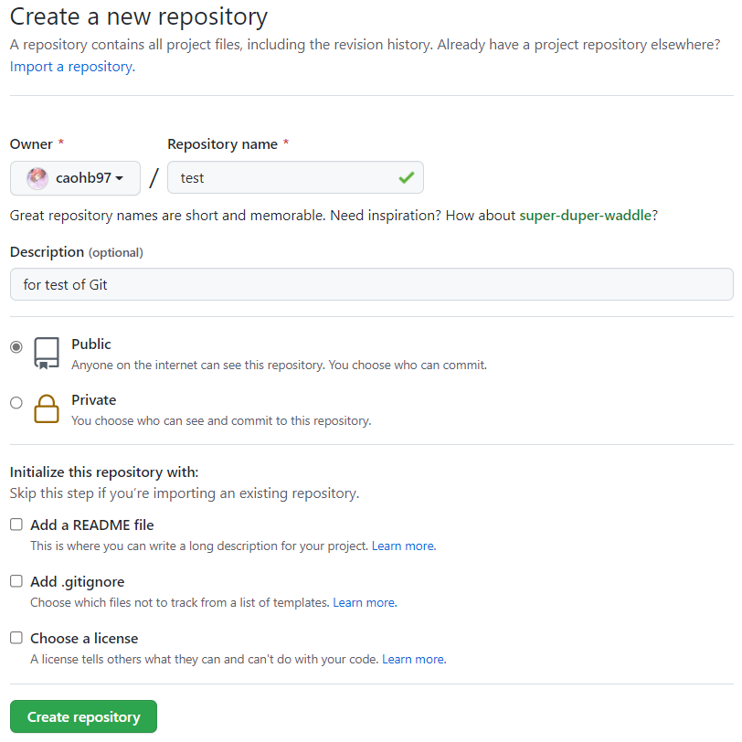

# Git学习与Merge使用

参考自：[黑马程序员Git全套教程](https://www.bilibili.com/video/BV1MU4y1Y7h5)、[Sublime Merge视频教程](https://www.bilibili.com/video/BV1Wp4y1Q77c)

## Git安装与环境配置

### 通过[Git 下载地址](https://git-scm.com/downloads)下载Git。

在安装过程中的选项选择中，可以直接默认选择，部分选项影响默认编辑器与是否直接通过PowerShell打开Git，根据需求配置即可。

### 基本配置

1. 设置用户信息

```shell
git config --global user.name "caohb"
git config --global user.email "xxx@gmail.com"
```

查看配置信息

```shell
git config --global user.name
git config --global user.email
```

2. 为常用指令配置别名

首先，打开Git bash并进入\~目录，通过```touch ~/.bashrc```创建配置文件。

之后在```.bashrc```文件中输入如下内容：
```
# 用于输出当前目录所有文件及基本信息
alias ll='ls -al'
# 用于格式化Git日志记录
alias git-log='git log --pretty=oneline --all --graph --abrev-commit'
```

最后打开Git bash，执行```source ~/.bashrc```即可完成配置。

3. 解决Git bash乱码问题

**在实际使用中（Windows）并未遇到中文乱码问题，并且在下述操作中没有权限修改```bash.bashrc```文件。**

首先，打开Git bash执行下面的命令：

```
git config --global core.quotepath false
```

之后在```${git_home}/etc/bash.bashrc```文件后面加入下面两行。（```${git_home}```目录为Git安装目录）

```
export LANG="zh_CN.UTF-8"
export LC_ALL="zh_CN.UTF-8"
```

<!--
**修改Git工作的~目录**
默认情况下，Git的\~目录为Windows用户目录，但是有时希望将Git相关的配置文件放置到特定的目录，就需要修改\~目录。
-->

## Git常用命令

1. 创建本地仓库

在要作为仓库的文件夹下打开Git bash窗口，执行```git init```命令。创建成功后可在文件夹下看到隐藏的```.git```目录。

2. 查看文件修改状态

- 作用：查看修改的状态（暂存区、工作区）
- 命令形式：```git status```

3. 将工作区修改添加到暂存区

- 作用：添加工作区对一个或多个文件的修改到暂存区。
- 命令形式：```git add .```、```git add filename```

4、提交暂存区内容到本地仓库

- 作用：提交暂存区内容到本地仓库的当前分支
- 命令形式：```git commit -m "注释"```


5. 查看提交日志

- 查看提交记录
- 命令形式：```git log [option]```
- - ```--all```显示所有分支
- - ```--pretty=oneline```将提交信息显示为一行
- - ```--abrev-commit```是输出的commitID 更加简短
- - ```--graph```以图的形式显示

6. 版本回退

- 作用：版本切换
- 命令形式：``````git reset --hard commitID```
- - commitID可以通过```git-log```指令查看
- 查看已经删除的记录
- - ```git reflog```可以看到已经删除的提交记录

7. 添加文件到忽略列表

一般总有些文件无需纳入Git管理，例如日志文件、临时文件已经包含隐私信息的文件。

这种情况下，可以在工作目录创建一个名为```.gitignore```的文件，列出要忽略的文件列表。该文件示例如下：

``` shell
# 忽略后缀为.a的文件
*.a
# 在忽略后缀为.a的文件的前提下，将lib.a纳入Git管理
!lib.a
# 只忽略当前文件夹的TODO文件，不忽略子文件夹的同名文件
/TODO
# 忽略build/文件夹下的所有文件
build/
# 只忽略doc文件夹下的*.txt文件，不忽略doc/*/*.txt文件
doc/*.txt
# 忽略doc文件夹下的所有.pdf文件
doc/**/*.pdf
```

## Git本地分支

使用分支意味着可以把工作从开发主线上分离开来进行项目开发，以免影响开发主线。

1. 查看本地分支

- 命令形式：```git branch```

2. 创建本地分支

- 命令形式：```git branch branchName```

3. 切换分支

- 命令形式：```git checkout branchName```
- 可以直接创建并切换到一个不存在的分支（不可以切换到已存在的分支）```git checkout -b branchName```

4. 合并分支

- 作用：将其他分支上的提交合并到当前分支
- 命令形式：```git merge branchName```

5. 删除分支

- 不能删除当前分支，只能删除其他分支。
- ```git branch -d b1```删除分支前检查是否有未提交的修改
- ```git branch -D b1```删除分支前不进行任何检查

6. 解决冲突

合并分支时，两个分支如果同时修改了同一个文件，可能会出现冲突，此时需要手动解决冲突。冲突的出现可能是项目的文件结构存在不可理的地方，需要调整文件结构以减少冲突的发生。解决冲突的步骤如下：
-  处理文件中冲突的地方
- 将解决完冲突的文件添加到暂存区
- 将修改提交到仓库

7. 分支使用的原则与流程

在开发中，一般有如下的分支使用原则与流程：

- master（生产）分支

线上分支，主分支，中小规模项目作为线上运行的应用对应分支；

- develop（开发）分支

从master创建的分支，一般作为开发部门的主要开发分支，阶段开发完成时需要合并到master分支，准备上线。

- feature/xxx分支

从develop创建的分支，一般是同期并行开发，分支上的研发任务完成后合并到develop分支。

- hotfix/xxx分支

从master派生的分支，一般作为线上bug修复使用，修复完成后需要合并到master、develop、test等分支。

- 还有一些其他分支，如：test（用于代码测试）、pre（预上线分支）等。


## Git远程仓库

### 创建远程仓库

首先在GitHub创建远程仓库，下半部分三个字段默认即可，不需要系统初始化。



仓库创建后，可以看到仓库对应的地址，使用SSH传输。


### 配置SSH公钥

- 生成SSH公钥
- - ```ssh-keygen -t rsa``` 
- - 如果公钥已经存在，则**自动覆盖**
- Github设置账户公钥
- - 获取公钥：```cat ~/.ssh/id_rsa.pub```
- - 在Github→Settings→SSH and GPG keys界面添加SSH key，添加完成后界面如下图所示。


### 操作远程仓库

#### 添加远程仓库

将本地仓库与已建立的远程库进行对接。

- 命令为：```git remote add <远端名称> <仓库路径>```
- 远端名称默认设置为```origin```，仓库路径即之前创建远端仓库时生成的SSH路径。例如：

```
git remote add origin git@github.com:caohb97/test_for_git.git
```

#### 查看远程仓库

- 作用：查看当前仓库连接到的远程仓库。
- 命令：```git remote```

#### 推送到远程仓库

命令：```git push origin master```

第一次执行该命令会出现如下提示，意味着远端仓库分支被命名为master。

```
To github.com:caohb97/test_for_git.git
 * [new branch]      master -> master
```

命令完整格式：```git push [-f] [--set-upstream] [远端名称[本地分支名][:远端分支名]]```

- 如果远端分支名与本地分支名相同，则可以省略远端分支名。
- ```-f```表示强制覆盖，不应该使用，需要先pull，修改后再push。
- ```--set-upstream```推送到远端的同时，建立起与远端分支的关联关系。例如推送前远端已有分支，则需要告诉远端和那个分支建立关联。

- 如果当前分支已经与远端分支建立关联，则推送时可以直接使用```git push```。

```--set-upstream```的操作如下所示：

``` shell
# 通过git branch -vv查看本地分支与远程分支的对应关系
$ git branch -vv
* master 3aaf2c6 remark		# 表示当前本地分支没有与远程分支关联
# 执行git push显示存在错误，需要先进行仓库的链接
$ git push
fatal: The current branch master has no upstream branch.
To push the current branch and set the remote as upstream, use
    git push --set-upstream origin master
# 将本地分支与远程分支关联
$ git push --set-upstream origin master:master
Everything up-to-date
Branch 'master' set up to track remote branch 'master' from 'origin'. 
$ git branch -vv
* master 3aaf2c6 [origin/master] remark		# 表示当前本地分支与远程分支关联成功
# 之后需要推送时，直接git push即可
$ git push
Everything up-to-date
```

#### 从远程仓库克隆

- 把远程仓库直接clone到本地。
- 命令：```git clone <仓库路径> [本地目录]```
- 仓库路径即为仓库SSH链接。如果不设置本地目录，会自动生成一个和远程仓库名相同的目录。

#### 从远程仓库抓取与拉取

远程分支和本地分支一样，可以进行merge操作，需要先把远端仓库里的更新下载到本地，再进行操作。

- 抓取命令：```git fetch [remote name] [brance name]```
- - 将仓库的更新抓取到本地，但不进行合并。
- - 如果不指定远端名称和分支名，则抓取所有分支。
- 拉取命令：```git pull [remote name] [brance name]```
- - 将仓库的更新抓取到本地，并进行合并，等同于```fetch+merge```。
- - 如果不指定远端名称和分支名，则抓取所有分支，并更新**当前分支**。

#### 解决合并冲突

向远端提交推送前，如果远端内容已经发生了变化，需要先从远端拉取仓库，解决合并冲突后再推送到远端分支。

远程分支也是分支，合并时冲突的解决办法和解决本地冲突相同。

## 使用Sublime Merge

- 完全基于Git API

- ```Stage ALL```→```git add .```
- ```Commit files```→```git commit -m " "```
